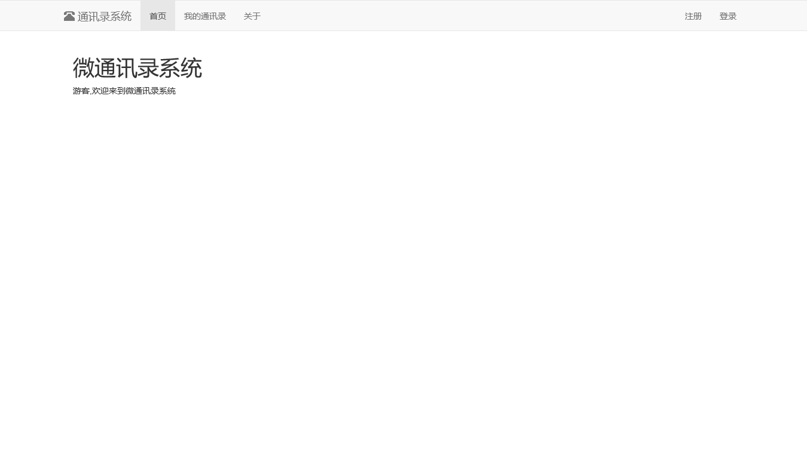
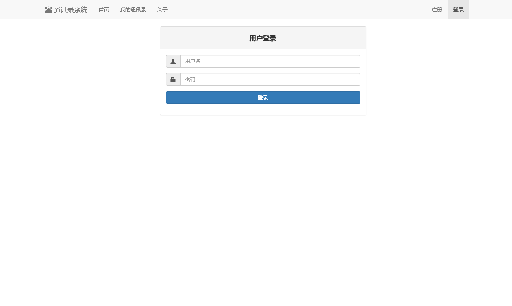
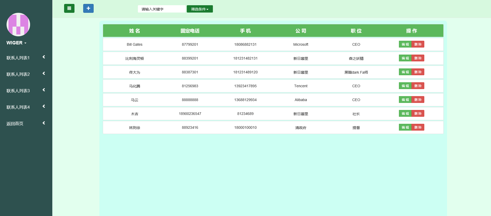
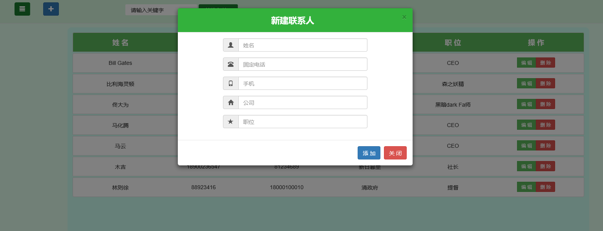

# AddressList
基于MVC架构的使用nodejs的express框架和mysql实现的通讯录系统

## MVC架构说明
* M(Model——模型)：应用程序中用于处理应用程序数据逻辑的部分，通常模型对象负责在数据库中存取数据。
* V(View——视图)：应用程序中处理数据显示的部分，通常视图是依据模型数据创建的。
* C(Controller——控制器)：应用程序中处理用户交互的部分，通常控制器负责从视图读取数据，控制用户输入，并向模型发送数据。

## 项目详解

### Model层
本项目在Model层定义了用户类Users以及联系人类Contacts，还有一些数据库增删查改的指令，以对数据库进行存取。

#### 数据库结构详解
* 数据库使用mysql编写
* 数据库中有两个基本表，用户表users和联系人表contacts
* 用户表users的字段有用户名username和密码password
* 联系人表contacts的字段有：序号id、所属用户名user、联系人名name、固话telephone、手机mobile、公司company、职位post

#### 建表代码
##### 用户表users
    CREATE TABLE users(
    username VARCHAR(15) PRIMARY KEY,
    password VARCHAR(16)
    );

##### 联系人表contacts
    CREATE TABLE contacts(
    id INT(5) PRIMARY KEY AUTO_INCREMENT,
    user VARCHAR(15) ,
    name VARCHAR(15) NOT NULL,
    telephone VARCHAR(15),
    mobile VARCHAR(15),
    company VARCHAR(15),
    post VARCHAR(15),
    FOREIGN KEY (user) REFERENCES users(username) ON DELETE CASCADE
    );

#### 插入数据
##### 用户表
    insert into users values("WIGER","123456");

##### 联系人表
    insert into contacts (user,name,telephone,mobile,company,post) values("WIGER","林则徐","88923416","18000100010","清政府","提督");
    insert into contacts (user,name,telephone,mobile,company,post) values("WIGER","Bill Gates","87799201","18086882131","Microsoft","CEO");
    insert into contacts (user,name,telephone,mobile,company,post) values("WIGER","比利海灵顿","88399201","181231482131","新日暮里","森之妖精");
    insert into contacts (user,name,telephone,mobile,company,post) values("WIGER","佟大为","88387301","181231489120","新日暮里","黑暗dark Fa师");
    insert into contacts (user,name,telephone,mobile,company,post) values("WIGER","马化腾","81256983","13923417895","Tencent","CEO");
    insert into contacts (user,name,telephone,mobile,company,post) values("WIGER","马云","88888888","13688129934","Alibaba","CEO");

#### 数据操作
##### 选择
    SELECT name,telephone,mobile,company,post FROM contacts WHERE name LIKE 'Ma%' and user='WIGER';
    SELECT name,telephone,mobile,company,post FROM contacts WHERE company LIKE 'T%' and user='WIGER';

##### 修改
    UPDATE contacts SET mobile='18086882131' WHERE name='MaHuaTeng';

##### 删除
    DELETE FROM contacts WHERE user='WIGER"' AND name='林则徐';

##### 插入
    INSERT INTO contacts VALUES('WIGER','木吉','12345678','11223344556','新日暮里','社长');

### Routes(Controller)层

本项目的Controller层负责对客户端来自不同URI的不同请求进行相应的处理和响应

#### Node.js Express框架的路由

路由是指如何定义应用的端点（URIs）以及如何响应客户端的请求。

路由是由一个 URI、HTTP 请求（GET、POST等）和若干个句柄组成，它的结构如下： app.METHOD(path, [callback...], callback)， app 是 express 对象的一个实例， METHOD 是一个 HTTP 请求方法， path 是服务器上的路径， callback 是当路由匹配时要执行的函数。

在项目中路由router的作用相当于MVC模式中的控制器Controller

### View层

本项目的View层使用Ejs模板，根据服务器不同的响应渲染出相应的页面

#### 页面截图

